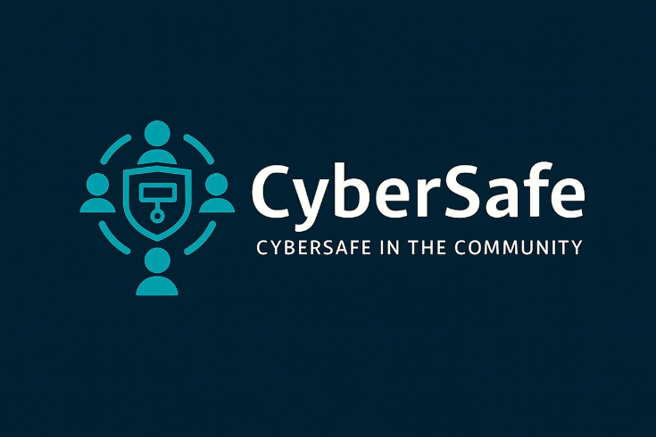

  
  

    <h1 class="hero-title">CyberSafe in the Community</h1>
    
Practical, friendly guidance to help our community stay safe online.

  

<strong>What we do.</strong> We turn cybersecurity into simple, doable steps for everyday life—especially for older adults. Learn to spot scams, use strong passwords and 2FA, secure your home Wi‑Fi, and keep your devices up to date.

## Start Here

<h3>Why is Fraud a Problem?</h3>
Fraud targeting older adults has surged in recent years, with billions lost annually. Scammers exploit urgency, trust, and fast-changing technology. This section covers the scale of the problem, why seniors are targeted, and the real-world impact on finances and wellbeing.

<a class="download-btn" href="sections/why-is-fraud-a-problem/">Read more</a>

<h3>Recognizing and Preventing Common Scams</h3>
Spot the red flags across phishing, tech-support, government impostors, romance, sweepstakes, and grandparent scams. Learn practical ways to verify before you trust and report attempts safely.

<a class="download-btn" href="sections/recognizing-and-preventing-common-scams/">Read more</a>

<h3>Practical Steps for Protection</h3>
Simple, high-impact habits reduce risk: pause-and-verify, limit oversharing, use official channels, and document/report suspicious activity. Use our checklist to build lasting cyber habits.

<a class="download-btn" href="sections/practical-steps-for-protection/">Read more</a>

<h3>Keeping Devices Updated</h3>
Updates fix security flaws. Turn on automatic updates for your computer and phone, restart occasionally, and keep apps current to stay ahead of threats.

<a class="download-btn" href="sections/keeping-devices-updated/">Read more</a>

<h3>Password Safety and 2FA</h3>
Strong, unique passwords + two-factor authentication block most account takeovers. Learn passphrases, password managers, and how to handle verification codes safely.

<a class="download-btn" href="sections/password-safety-and-2fa/">Read more</a>

<h3>Safe Social Media Use</h3>
Use privacy settings, think before you post, and accept friend requests only from people you know. Keep accounts locked down with strong passwords and 2FA.

<a class="download-btn" href="sections/safe-social-media-use/">Read more</a>

<h3>Wi-Fi & Home Network Security</h3>
Secure your home network: change default router logins, use WPA2/WPA3, set a strong Wi‑Fi password, update router firmware, and consider a guest network for visitors.

<a class="download-btn" href="sections/wi-fi-and-home-network-security/">Read more</a>

<h3>Antivirus and Security Software</h3>
Protect your devices from malware and viruses with reliable security software. Keep it updated and running to detect and block threats before they can harm your system.

<a class="download-btn" href="sections/antivirus-and-security-software/">Read more</a>

<h3>Key Takeaways for Staying Safe Online</h3>
A quick recap of the essential habits that make you resilient online—share these with friends and neighbors.

<a class="download-btn" href="sections/key-takeaways-for-staying-safe-online/">Read more</a>

---

## About Me

  
  

Hi, I’m a high school student with a passion for cybersecurity and digital safety. Ever since I first got my hands on a device, I’ve been fascinated by how technology works - and yes, even finding ways around parental controls taught me how much I love discovering loopholes.

Over the years, I’ve seen how quickly technology evolves and how hard it can be for people to keep up, especially older adults. I’ve also seen the rise in online scams and the real harm they cause. That’s why I started CyberSafe in the Community - to empower adults with the knowledge and tools they need to protect themselves online.

My goal is simple: help people feel confident using technology so they can stay connected with their families without fear.
  

